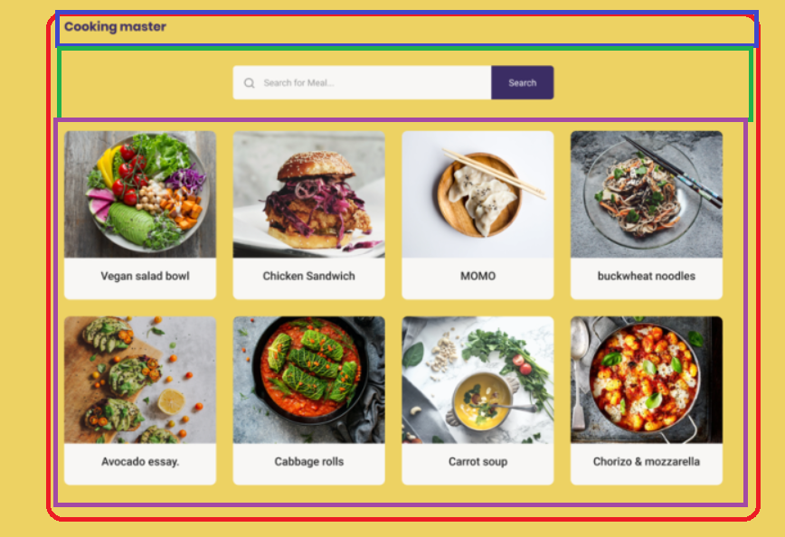
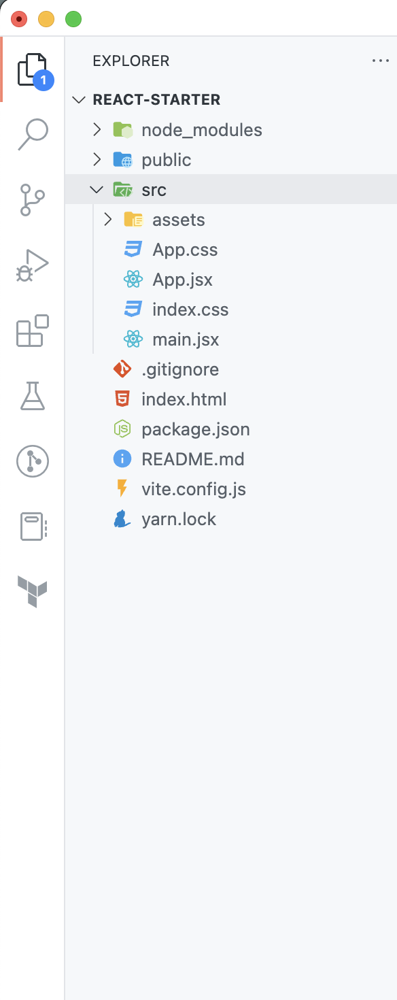
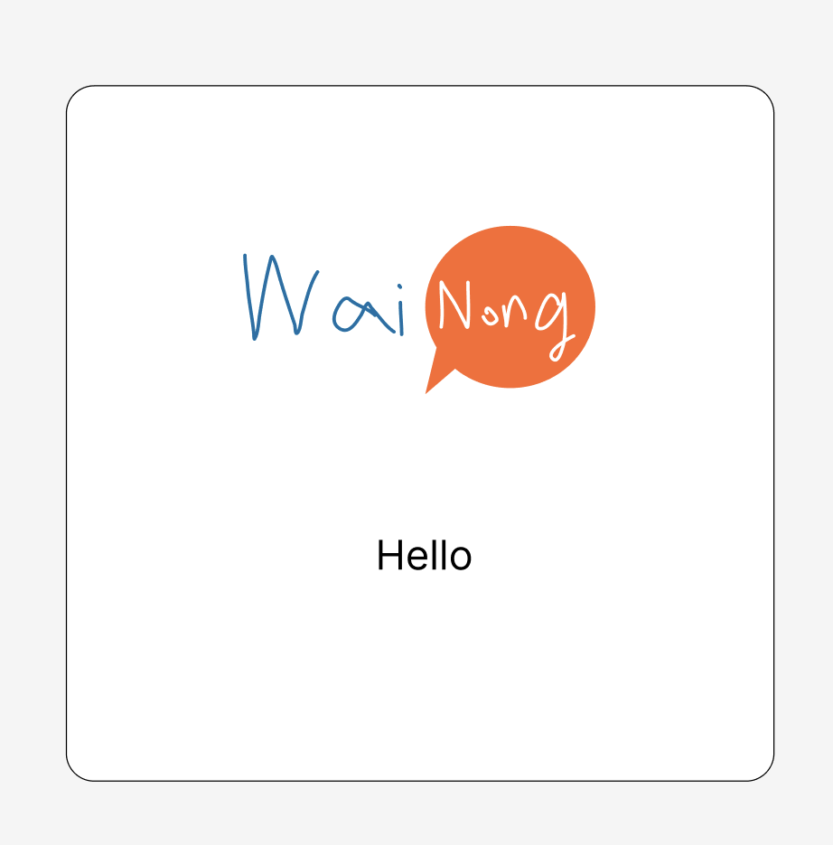
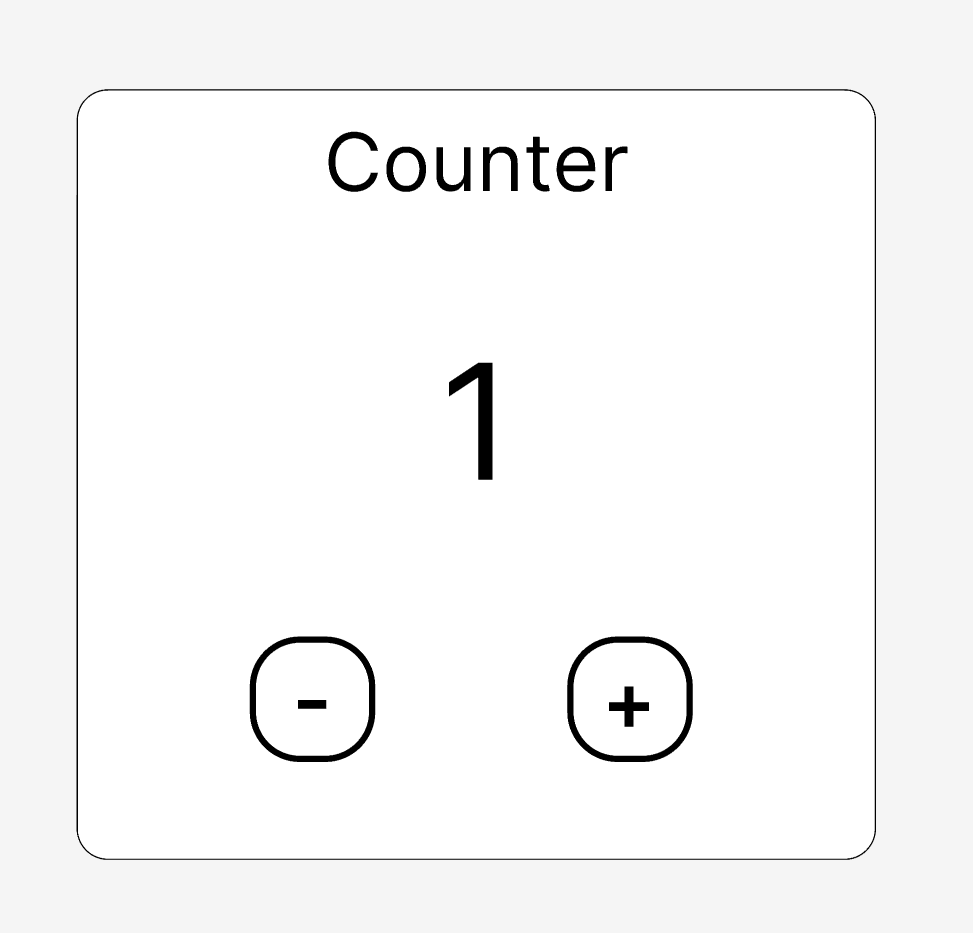

<div align="center">

# Exceed Day 3 - React Crash Course
ในนี้จะเป็นการสรุปแต่ละหัวข้อแบบสั้นๆที่รวบรวมมาจากเว็บเซ็ตต่างๆและความรู้เท่าที่มีอยู่ให้พอได้เข้าใจโดยคร่าวๆ ในแต่ละหัวข้อสามารถเข้าไปเรียนรู้เพิ่มเติมโดยละเอียดได้ในลิงก์ที่แนบไว้ในแต่ละหัวข้อ ขอบคุณครับ

</div>

<div align="center">

<br>

## สิ่งที่เราจะมาเรียน/ทำกันในวันนี้
# 

</div>

- [] [อะไรคือ DOM (Document Object Model)](#dom)
- [] [อะไรคือ Event Listener](#event)
- [] [ทำไมต้องใช้ Library อย่าง React](#react-what)
- [] [การสร้างโปรเจ็ค React](#start-project)
- [] [ลองสร้าง Component ง่ายๆ](#create-component)
- [] [ทำความรู้จักกับโครงสร้างโปรเจ็ค React](#structure)
- [] [การ Import และ Export](#import)
- [] [React Props](#prop)
- [] [List Rendering](#list)
- [] [Reacting to Event](#react-event)
- [] [React State](#state)
- [] [Data Fetching & useEffect](#fetch)

<a id="dom" style="color: black">

### 🏠 อะไรคือ DOM (Document Object Model)
#

DOM คือโมเดลตัวแทนที่แสดงสิ่งต่างๆที่อยู่บนเว็บของเราซึ่งทุกอย่างนั้นจะถูกเรียกว่าเป็น Object ไม่ว่าจะเป็น Tag HTML อย่าง `head` `body` `div`
หรือข้อความที่อยู่ใน `div` และ Object นั้นจะถูกเก็บในรูปแบบของ Tree Structure   

การมี DOM จะทำให้เราสามารถที่จะ interact กับ หน้าเว็บในแบบต่างๆเช่นเราสามารถเอา tag `p` ในหน้านั้นมาเพื่อแก้ไขคำใน tag นั้นได้ หรือเพิ่ม/ลบ element tag ใน DOM ก็ได้เช่นกัน

เราสามารถดึง element นั้นๆมาแก้ไขได้โดยการ query จาก **ชื่อ tag, id, class, etc.** โดยในที่นี้จะแนะนำคำสั่งเพียงอย่างเดียวในการยุ่งกับ element บนหน้าโดยการใช้ Javascript

สมมุติมี html
```html
<html>
.
.
.
<body>
    <p class="text">This is p in the DOM</p>
</body>
.
.
.
</html>
```
เราสามารถใช้คำสั่งเพื่อหา element ที่ match กับรูปแบบ argument ที่เราให้ไป
```js
const pFromTag = document.querySelector("p") // query จาก tag
const pFromClass = document.querySelector(".text") // query จาก class
```
เราก็จะได้ element `<p class="text">This is p in the DOM</p>` มาเก็บไว้ในตัวแปรของเราแล้วเราสามารถลองแก้ไข Text ด้านในเช่น
```js
pFromTag.innerText = "Modified p tag content"
```
  

ตัวอย่าง​ DOM Tree  


อ่านเพิ่มเติม  
- [Introduction to DOM [MDN]](https://developer.mozilla.org/en-US/docs/Web/API/Document_Object_Model/Introduction)
- [DOM Tree [JavascriptInfo]](https://javascript.info/dom-nodes)


</a>

<a id="event" style="color: black">

### ⚡️ Event และ Event Listener
#

สิ่งต่างๆที่เกิดขึ้นบนเว็บของเรา ตัวอย่างเช่น การลากเมาส์, การคลิ้ก, การส่งฟอร์ม, การขยาย/ลดหน้าจอเป็นต้น  

บน Event ที่เกิดขึ้นในหน้าของเรา การที่เราจะสามารถทำให้ element ต่างๆบนหน้าของเรามีการตอบสนองกับ event นั้นจะต้องให้ element นั้นทำการรอฟัง event นั้น (Event Listener) และเมื่อ event นั้นเกิดขึ้นเราสามารถบอกได้ว่าจะให้เกิดอะไรขึ้นหลังจากนั้น (Callback)

ตัวอย่าง
```js
const button = document.querySelector("button"); // สมมุติว่ามีปุ่มอยู่บนหน้าอยู่แล้้ว
button.addEventListener("click", () => {
    console.log("ฉันโดนคลิ้ก")
}) // เราก็ให้มันรอ event และทำการ log เมื่อโดนคลิ้ก
```

อ่านเพิ่มเติม
- [Events [MDN]](https://developer.mozilla.org/en-US/docs/Learn/JavaScript/Building_blocks/Events)

</a>

<a id="react-what" style="color: black">

### 🤔 React คืออะไรและทำไมต้องใช้ Library แบบ React
# 

React คือ Library สำหรับสร้างหน้าเว็บที่ช่วยแก้ปัญหา/ความยุ่งยากอย่างเช่นการใช้ API Document Selector ในการหยิบยุ่งกับ element ต่างๆบน DOM เพื่อมาแก้ไขหรือการสร้าง element ที่ค่อนข้างยุ่งยากเมื่อเว็บของเราเริ่ม scale ใหญ่ขึ้น 

โดยการทำงานของ React นั้นก็คือ React จะสร้าง Virtual DOM หรือ DOM แบบจำลองขึ้นมาเป็นของตัวเอง หรือในชื่อ ReactDOM เพื่อที่เอาไว้ใช้เปรียบเทียบกับ DOM ตัวจริง        

เมื่อเกิดการมีการเปลี่ยนข้อมูลเกิดขึ้น ReactDOM จะเปลี่ยน Element นั้นๆใน DOM ของตัวเอง แล้วก็จะเอา DOM ของตัวเองไปเทียบกับ DOM จริง Object ที่ต่างกันในแต่ละ DOM จะถูกนำเข้า/และนำออกจาก DOM ตัวจริงโดยอัตโนมัติ

ในการเขียนบน React เราจะแบ่งส่วนต่างๆบนหน้าเว็บออกเป็นส่วนๆเรียกว่า Component ในหน้าเว็บหนึ่งหน้าก็จะเป็นการประกอบรวมกันของ Component หลายๆอย่างเข้าด้วยกัน


เช่นในรูปด้านบนก็จะเห็นว่าในหน้าเว็บๆนึง เราสามารถแบ่งส่วนๆต่างๆออกเป็นชิ้นๆตามที่เห็นกล่องสีต่างๆเป็นต้น

เหตุผลที่ใช้ React:
- ~~พรี่ๆเขียนเป็นแต่ React~~
- เป็น Library ยอดนิยม หา Doc อ่านได้อย่างง่ายและทั่วถึง มี Library อื่นๆมากมายที่เขียนมาเพื่อให้ทำสิ่งต่างๆง่ายขึ้นบน React
- สามารถแบ่งส่วนต่างๆออกเป็น Component เพื่อให้ง่ายต่อการเขียนและการอ่าน
- ไม่ต้องมานั่งจัดการกับ DOM ด้วยตัวเองโดยตรง **ทำผ่าน syntax jsx แทน**
</a>

<a id="start-project" style="color: black">

### 🎉 การสร้างโปรเจ็ค React
#

ในการสร้างโปรเจ็ค React มี Tools หลายที่เราสามารถใช้ได้โดยในที่นี้เราจะใช้ [vite](https://vitejs.dev/guide/why.html) เพราะค่อนข้างทำให้เรารันโปรเจ็คได้ค่อนข้างเร็วมากๆ

เข้า Terminal แล้วเราจะใช้คำสั่งดังนี้เพื่อสร้างโปรเจ็คขึ้นมา  
`npm create vite@latest ชื่อแอพ/โฟลเดอร์ --template react`

รอสักครู่จนสร้างเสร็จเราก็จะเข้าไปในโฟลเดอร์  
`cd ชื่อแอพ/โฟลเดอร์`

ลง package ต่างๆที่จำเป็น  
`npm i`

ใช้คำสั่งนี้เพื่อรัน  
`npm run dev`

เมื่อรันก็จะได้ผลลัพธ์เป็นแบบนี้ เป็น template ชั่วคราวที่ Vite generate มาให้ตอนเริ่มต้น


และเราก็จะได้โฟลเดอร์หน้าตาแบบนี้มา




</a>

<a id="create-component" style="color: black">

### ลองสร้าง Component แรกใน React
#

ในไฟล์ `App.jsx` เราจะมาลองเพิ่ม Component ของเรากัน

ใน React เราจะเขียน component อยู่บนไฟล์สกุล `.jsx` คือเราจะสามารถเขียน HTML ไปบน Javascript ได้เลยทำให้เราสามารถเขียน Logic กับการ Render ไปพร้อมกันได้เลย

```jsx
function MyComponent() {
    const name = "Dawg"

    return (<h1>{name}</h1>)
}

const MyComponent = () => {
    const name = "Dawg";
    
    return (<h1>{name}</h1>)
}
```

วิธีการสร้าง Component ขึ้นมาก็คือ  
1. เราจะต้องสร้าง Function ที่จะ return JSX (แบบมีชื่อหรือ Arrow function ก็ได้เช่นกัน) โดยจะต้องตั้งชื่อให้ตัวแรกเป็นตัวพิมใหญ่ 
2. ในเนื้อหา Function เราสามารถเขียน Logic ต่างๆเก็บค่าแปรลงไปได้ ในที่นี่จะเก็บค่า `name` เพื่อไปใช้แสดงผล
3. เมื่อเราเขียน Logic เรียบร้อยเราก็จะมาเขียนหน้าตาของ Component กันต่อโดยเราจะเขียนก่อน return แล้วค่อยเอามาใส่ใน return ก็ได้แต่ในที่นี้จะเขียนในบรรทัด return ไปเลย
    - ในบรรทัด return จะเห็นว่าเราให้ Component เป็น tag `<h1>` เฉยๆโดยจะเห็นว่ามีการใส่ค่า name เข้าไประหว่าง tag ด้วยโดยจะถูกใส่ไว้อยู่ภายในปีกกา `{name}` การเขียนปีกกาจะเป็นการเขียน Javascript ทับเข้าไปบน html เลยโดยในตัวอย่างนี้ก็ค่าจะเอาค่าของ `name` ไปวางระหว่าง `<h1>`
4. เท่านี้ก็คือเสร็จเรียบร้อยเหลือการเอาไปใช้งาน

การเอาไปใช้งาน
- ในกรณีนี้เราเขียนไว้ในไฟล์เดียวกันเราก็จะนำไปใช้ได้เลย  
  
เราจะเอาใส่ใน Component App ซึ่งเป็น Component หลักแบบนี้
```js
function App() {

  return (
    <div className="App">
      <MyComponent />
    </div>
  )
}
```
เราก็จะเขียนคล้ายๆ tag html ปกติแต่เราจะใช้ชื่อ Component เราแทน โดยจะเป็นเปิดปิด `<></>` หรือปิดในตัวก็ได้ `</>`

</a>

<a id="structure" style="color: black">

### ทำความรู้จักกับโครงสร้างโปรเจ็ค React
#

`node_modules` - ไว้เก็บ modules/library ต่างๆที่เราติดตั้งไว้ใน Project ของเรา

`public` - เป็นโฟลเดอร์ที่ไว้เก็บรูปภาพที่เราไม่ได้ใช้ใน App หรือ Component ของเรา

`src` - เป็นโฟลเดอร์หลักของ App เราที่ใช้เขียน Component Function Logic Css ทุกอย่าง  
  - ใน src จะมีไฟล์เริ่มต้นสำคัญๆเช่น
    - main.jsx: เป็นจุดเริ่มต้นการสร้าง ReactDOM และการกำหนดว่า ReactDOM จะครอบคลุมเริ่มจากตรงไหนและกำหนดว่าเราจะ render component ไหนเป็น Component เริ่มต้น (มักจะเป็น `<App />`)
    - App.jsx: Component เริ่มต้นของเราที่จะเอา component อื่นๆมารวมกันให้เป็นหน้าเว็บ

`package.json` - รายละเอียดต่างๆสำหรับโปรเจ็ค รวมถึง command ที่ใช้ run project และอื่นๆก็สามารถตั้งได้ในนี้

</a>

<a id="import" style="color: black">

### การ Import และ Export ไฟล์
#

เมื่อไหร่ทำโปรเจ็คไปได้สักพักแน่นอนว่าเราน่าจะไม่อยากเขียนทุกอย่างอยู่ในไฟล์เดียวเพราะจะทำให้ดูยากเกินไปดังนั้นเราจะแบ่งไฟล์มาเขียนแยก แต่เราจะต้องรู้การนำไฟล์อื่นมาใช้และสามารถทำให้นำไปใช้ได้ก่อน

Export (เฉพาะ js): การส่งออกไฟล์ให้ไฟล์อื่นสามารถนำไปใช้ได้โดยเราสามารถ export ได้ทุกอย่างไม่ว่าจะเป็น Component, Function, ค่าตัวแปร  
โดยการ export จะมีสองแบบ
1. Default: คือเวลาที่ไฟล์อื่น import ไปจะได้ค่าที่ตั้ง Default ไปเลย ไม่ต้อง import ให้ตรงชื่อก็ได้  
```js
export default MyComponent
```
2. Named: คือเวลาไฟล์อื่นจะ import จะต้องใช้ชื่อเดียวกับตอน export
```js
export MyComponent
```
การ Export สองแบบนี้สามารถทำได้ในไฟล์เดียวกันแต่ Default จะมีได้แค่อันเดียวต่อไฟล์

Import: การนำไฟล์เข้ามาใช้ในไฟล์ปัจจุบัน ไม่ว่าจะเป็น Component, CSS, function, และอื่นๆ  
สมมุติว่ามีการ export ดังนี้  
```js
export default Component1
export Component2
```
เราจะ import แบบนี้
```js
import Component1, { Component2 } from './some-component.jsx'
```
แบบ Named เราจะต้องใส่ปีกกาครอบด้วย, ส่วนแบบ default ไม่ต้อง  
ในส่วนของ css เราก็จะพิม import เฉยๆเช่น
```js
import './App.css'
```
</a>

<a id="prop" style="color: black">

### React Props
#

สมมุติว่าเรามีกล่องๆนึงแบบนี้  

โค็ดอาจจะประมาณนี้
```js
const Box = () => {
    return (
        <div>
            
            <p>Hello</p>
        </div>
    )
}
```
ถ้าเราต้องการเอา Component ไปใช้ต่อกับข้อความอื่นหรือรูปอื่น เราจะทำได้อย่างไร ณ จุดนี้เรายังทำไม่ได้เพราะเรา hard-code ค่าไปเลยอยู่  
เราสามารถทำให้มัน dynamic ได้โดยการใช้ **prop**  
การใช้ prop คือการส่งค่าตัวแปรมาจาก Parent Component มาสู่ Component ปัจจุบัน ทีนี้เราก็จะส่งค่าใหม่ๆมาใส่รูปและข้อความใน component นี้ได้
โดยเราจะกำหนด props แบบนี้
```js
const Box = ({ imageName, message }) => {
    return (
        <div>
            
            <p>{message}</p>
        </div>
    )
}
```
ใน Argument ของฟังก์ชั่นของ Component เราจะกำหนดชื่อตัวแปรที่จะส่งลงมา แล้วเราจะสามารถนำค่าเหล่านั้นมาใช้ได้ใน Component เราตามปกติ  

หลังจากที่เรากำหนด props ของ Component นั้นแล้วเราจะเหลือการส่งลงมาจาก Parent Component ดังนี้
```js
// สมมุติที่ App.jsx
function App() {

  return (
    <div className="App">
      <Box imageName="wai-nong.png" message="hello" />
      <Box imageName="wai-nong2.png" message="hello2" />
    </div>
  )
}
```
เราก็จะเรียก Component เหมือนปกติแต่จะมีเพิ่มการใส่แนว ๆ attribute ใน html แต่ใส่เป็นชื่อ prop ที่เราจะส่งลงไปแทนและก็เขียนค่าที่จะส่งลงไป
</a>

<a id="list" style="color: black">

### List Rendering
#

เมื่อเรามี List ของข้อมูลแล้วเราต้องการจะนำมันไปแสดงผล ถ้าเราเอาค่าไปใส่ใน jsx เลยถูกแสดงผลเป็น text ธรรมดาหรืออาจจะได้ error กลับมาถ้าข้อมูลใน list เป็นประเภทที่นำไปแสดงไม่ได้เช่น Object ดังนั้นเราจะต้องแปลงมันให้ไปอยู่ใน Component หรือ HTML Element ซะก่อน  

เราสามารถทำได้ด้วยการใช้ Method Map ของ Array
```js
const people = [{ name: "Sup", age: 20, imageUrl: "person1.png"}, { name: "Caesar", age: 35, imageUrl: "person2.png"}]

// สมมุติมี Box ที่รับ prop เป็น { name, age, imageUrl }

function App() {
    return (
    <> 
        {people.map(p => <Box name={p.name} age={p.age} imageUrl={p.imageUrl}>)}
    </>
    )
}

```
จากตัวอย่างก็จะเห็นว่าเราใช้ `{}` เพื่อที่เขียน JS Map จาก people array ไปเป็น Component Box โดยเอาค่า `{name, age, imageUrl}` ของแต่ละคนไปใส่ prop ของ Box

</a>

<a id="react-event" style="color: black">

### Reacting to Event
#
จากที่เรียนไปแล้วว่า event เป็นยังไง แล้ว event listener คืออะไร ที่นี้จะมาลองเอา concept เหล่านั้นมาใช้ใน component ของเรากัน

สมมุติเราอยากได้ปุ่มที่พอกดแล้วจะมีข้อความขึ้นบนหน้าจอ สิ่งที่เราต้องทำก็คือ
1. สร้างปุ่ม
2. บอกให้ปุ่มรอฟัง event การคลิ้ก
3. กำหนดให้ปุ่มแสดงข้อความขึ้นบนจอเมื่อมี event การคลิ้ก

สมมุติปุ่ม
```js
const Button = () => {
    return (<button>Click</button>)
}
```
ตอนนี้ปุ่มก็จะกดไปก็ไม่มีอะไรเกิดขึ้น ทีนี้เราจะมาให้มันฟัง event click ด้วยการเพิ่ม attribute onClick ให้มัน
```js
const Button = () => {
    return (<button onClick={}>Click</button>)
}
```
ตอนนี้ก็ยังไม่เกิดอะไรขึ้นหลังกดอยู่ดี เราจะมากำหนดให้มันทำการแสดงข้อความกันต่อ
```js
const Button = () => {
    return (<button onClick={() => alert('Clicked!')}>Click</button>)
}
```
ทีนี้เราได้สร้าง callback ไปใส่ไว้ที่ onClick เมื่อโดนคลิ้กก็จะเรียก callback ที่เราเขียนลงไปแล้วแสดงข้อความขึ้นบนจอ

</a>

<a id="state" style="color: black">

### React State
#

ในบาง Component ของเราแน่นอนว่ามันจะต้องมีค่าที่ตัวมันเองจะต้องจำไว้ด้วย ยกตัวอย่างเช่นเรามี Component นับเลขโดยเรากด +/- เพื่อเปลี่ยนจำนวนได้


คำถามคืออะไรคือข้อมูลที่เปลี่ยนแปลงใน Component นี้...  
แน่นอนว่ามันก็คือค่าตัวเลขนั่นเองที่จะต้องจำไว้ตลอดว่าปัจจุบันคือเลขอะไร  
ด้วยเหตุผลนี้เราจะต้องรู้จักกับ State ของ React  
ถามว่าใช่แบบ let ไม่ได้หรอ?  
คำตอบก็คือไม่ได้เพราะเหตุผล 2 อย่าง
- ตัวแปร local เมื่อมีการ re-render ค่าจะหายไป
- react จะไม่สนว่าเมื่อค่า local เปลี่ยนจะต้องมีการ re-render

เราเลยต้องใช้ useState hook โดยวิธีใช้ก็ดังนี้
```js
import { useState } from 'react'; // import hook มาก่อน

const Counter = () => {
    const [number, setNumber] = useState(1) // hook จะ return ค่าสองอย่างคือ ค่า state กับ ฟังก์ชั่นที่ไว้เปลี่ยนค่า state

    const handleIncrement = () => setNumber(number + 1) // create callback to increase number state by 1 when called
    const handleDecrement = () => setNumber(number - 1) // create callback to decrease number state by 1 when called

    return (
        <div>
            <h1>{number}</h1> // show value from state
            <button onClick={handleIncrement}> // bind onclick to increment
            <button onClick={handleDecrement}> // bind onclick to decrement
        </div>
    )
} 
```
สรุปโค็ดข้างบน
1. เราตั้ง state ไว้จำค่าตัวเลข แล้วได้ `number` ที่เป็นตัวแทนค่า กับ `setNumber` ที่ไว้ใช้ set ค่า number
2. สร้าง callback ที่สร้างจากฟังก์ชั่น setNumber ไปใส่ปุ่มให้เพิ่ม/ลด
3. เอาค่า state `number` ไปแสดงใน <h1>

เพิ่มเติม: ถ้าเราลองสร้าง Component นี้ขึ้นมาหลายๆตัวแล้วเราลองกดเพิ่ม/ลด ดูก็จะเห็นว่าแต่ละตัวนั้นมีเลขเป็นของตัวเอง และไม่ยุ่งเกี่ยวกัน state ใคร state มัน
</a>

<a id="fetch" style="color: black">

### Data Fetching & useEffect
#

สุดท้ายเราจะมาดูการ fetch ข้อมูลมาใส่ component ของเรากัน  
เราก็ใช้โค็ดที่ได้เรียนไปในการ fetch แบบนี้ในการเอาข้อมูล pokemon มาแสดง
```js
const URL = 'https://pokeapi.co/api/v2/pokemon/'

const fetchData = async () => {
    try {
      const response = await fetch(URL + id)
      const result = await response.json()
      console.log(result)
    } catch (err) {
      console.log(err)
    }
  }
```
ถ้าเราลองเอา function นี้ไปใช้ใน Component ของเราดู
```js
function App() {
  const URL = 'https://pokeapi.co/api/v2/pokemon/'

  const fetchData = async (id) => {
    try {
      const response = await fetch(URL + id)
      const result = await response.json()
      console.log(result)
    } catch (err) {
      console.log(err)
    }
  }

  fetchData()
  
  return (
    <div className="App">
        <p>{pokemon.name}</p>
    </div>
  )
}
```
ก็จะสามารถเห็น console log เป็นข้อมูลปกติ แต่ปัญหาคือเราไม่ได้อยากดู log แต่เป็นการเอาข้อมูลมาแสดงก่อนอื่นเลยเราก็ต้องมี state มาจำว่าตอนนี้ pokemon บนหน้ามีตัวไรบ้างเป็น array

```js
function App() {
    const [pokemon, setPokemon] = useState({}) // default เป็น object เปล่า
    const URL = 'https://pokeapi.co/api/v2/pokemon/'

    // ทีนี้ใน fetch ลอง set state ไปด้วยจะเกิดอะไรขึ้น
    const fetchData = async () => {
    try {
      const response = await fetch(URL + id)
      const result = await response.json()
      console.log(result)
      setPokemon(result)
    } catch (err) {
      console.log(err)
    }
    }

    fetchData()

    return (
        <div className="App">
            <p>{pokemon.name}</p>
        </div>
    )
}
```
ถ้าเราไปดูใน browser ก็จะเห็นว่าหน้ามีข้อมูลขึ้นมาปกติแต่จะมีปัญหาถ้าเราไปดู console log มันขึ้นผลลัพธ์รัวๆ คำถามคือทำไม?  
เพราะว่า React จะมีการ re-render ทุกครั้งที่ state เปลี่ยน  
แล้วเราจะแก้ปัญหานี้ได้ยังไง?  
React ได้สร้าง hook ขึ้นมาอันนึงชื่อ `useEffect` สิ่งที่มันจะรับ effect callback ไว้ (ของเราก็คือการ fetch ข้อมูล) และมันจะให้ component ของเราได้ render ให้เรียบร้อยแล้วมันจะเอา effect callback มาเรียกหลังจาก render เสร็จ  
useEffect จะรับ parameter 2 ตัวคือ
1. callback function ที่จะมาเรียกหลัง render เสร็จ
2. dependencies เป็น list ของค่าที่ถ้าเกิดมันเปลี่ยนให้ทำการเอา callback มารันอีกเช่น
เราตั้ง dependencies เป็น [id] ถ้าเกิด id pokemon เปลี่ยนมันก็ไปเรียก callback fetch ใหม่ด้วย id ใหม่ หรือถ้าเราอยากให้มันเรียกครั้งเดียวก็จะใส่ list ว่าง []
พอเราลองใช้ useEffect มันก็จะเป็นแบบนี้
```js
function App() {
    const [id, setId] = useState(0)
    const [pokemon, setPokemon] = useState({}) // default เป็น object เปล่า
    const URL = 'https://pokeapi.co/api/v2/pokemon/'

    // ทีนี้ใน fetch ลอง set state ไปด้วยจะเกิดอะไรขึ้น
    const fetchData = async () => {
    try {
      const response = await fetch(URL + id)
      const result = await response.json()
      console.log(result)
      setPokemon(result)
    } catch (err) {
      console.log(err)
    }
    }

    useEffect(() => {
        fetchData()
    }, [id])

    return (
        <div className="App">
            <p>{pokemon.name}</p>
            <button onClick={() => setId(id + 1)}>Next</button>
        </div>
    )
}
```


</a>
